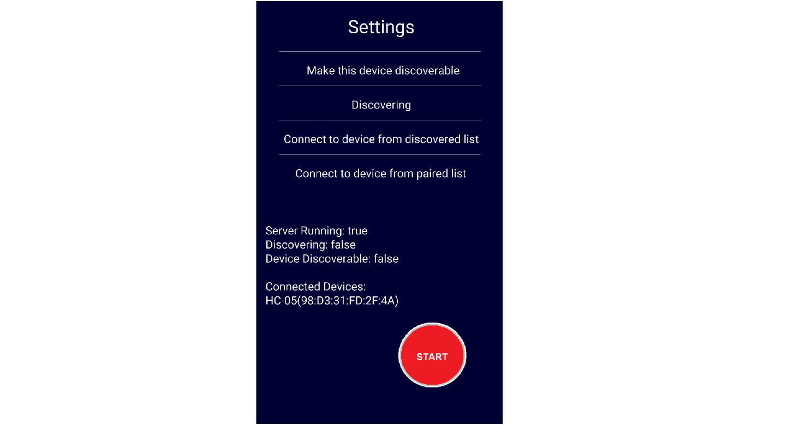
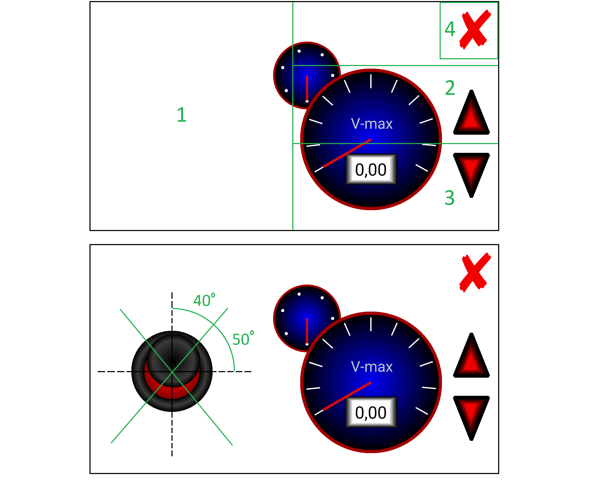
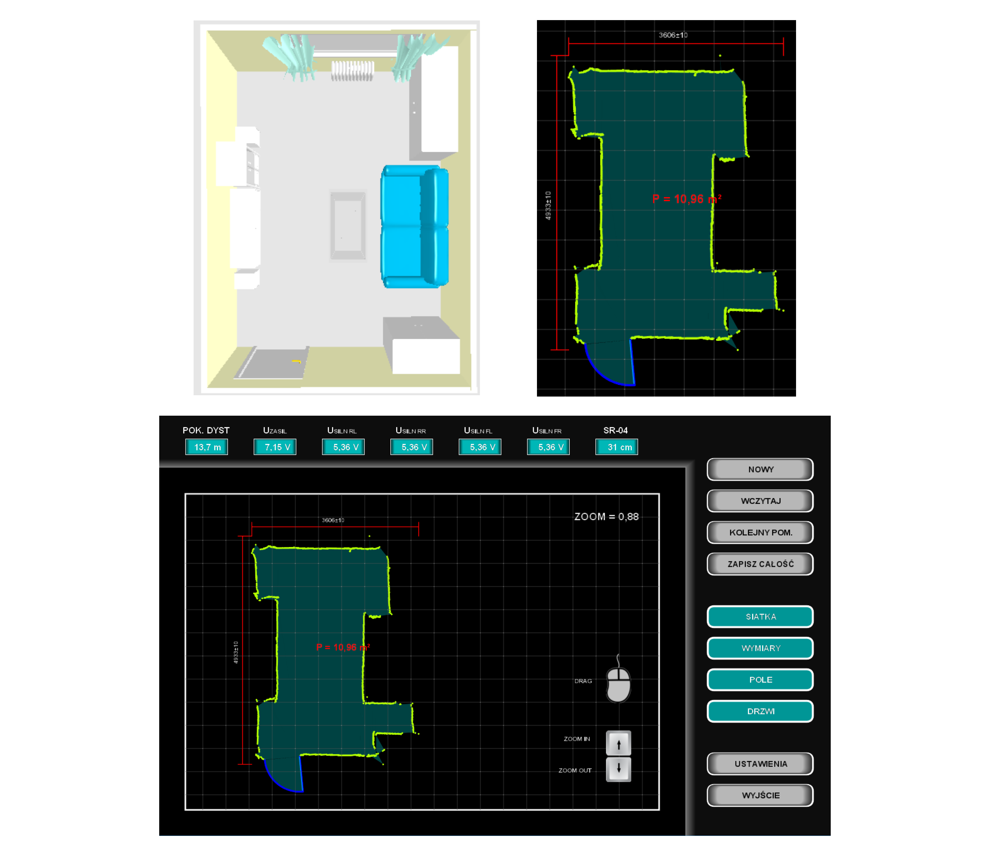
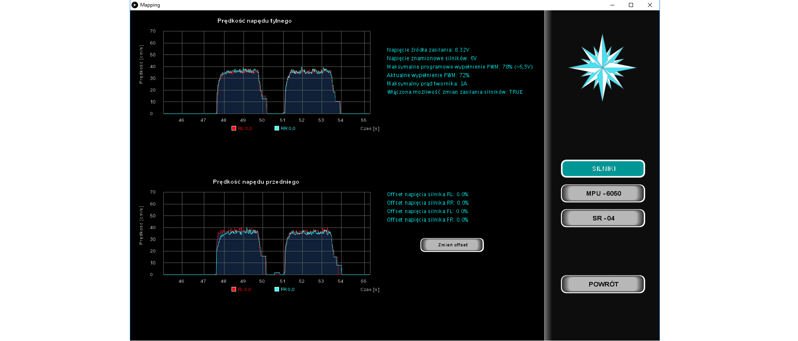

# The mobile distance meter

> Project provides solution to scan room in two dimensional area, based on robot with steering controller on Android. 
Result is presented on dedicated application on Windows system.  
This project is the first extensive project I have ever made.
With this project I have started my experience with graphics programming.
The first version of my program was written mainly without using OOP.
The project contains a lot of bad and non patterns solutions and was not written in an optimal way.
Currently, the project's code quality is being improved im my free time.

## Project assumptions:
- get posibble high measurements' precission with low cost electronic elements with program filters and solutions;
- develop universal operating panel which allows steering robot without looking on panel;
- create functions to render charts and maps; 
- render majority of buttons' gradients; 

## Project has implemented:
* Bluetooth connectivity between robot and PC;
* I2C communication betwen two Arduino modules;
* remote controller on Android system;
* protection for cut-off connection;
* calculate field and rectangle dimensions of any room;
* charts with data from robot's sensors;
* doors detection with drawing them outside of room scheme;
* import and export points to visualization;

## Android controller screenshots 

## PC application screenshots

## Thanks
I2Cdev device library code is placed under the MIT license.
Thanks Jeff Rowberg for this library.

## Requirements (will be change):
* Processing 3 libaries
* Arduino libraries

## Contact
Created by Mateusz Łyszkiewicz  
mat.lyszkiewicz@gmail.com
